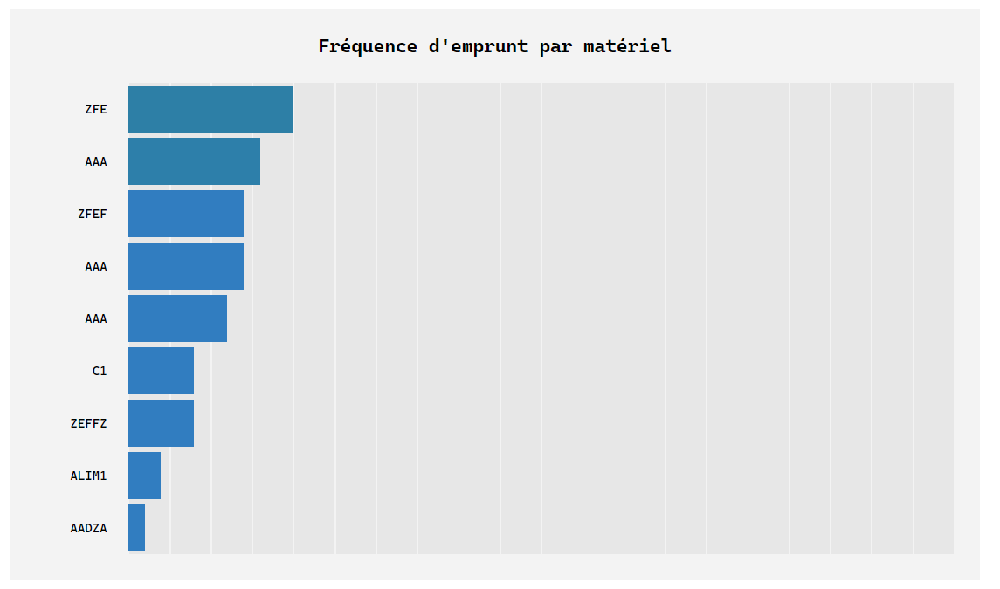

# GEM LABO PHYSIQUE

## MANUEL D'UTILISATION

### Rappel du contexte
Les élèves empruntent du matériel pour leurs expériences au laboratoire de 
sciences physiques ou en dehors du laboratoire et sont supposés noter sur une 
feuille la date de l’emprunt, leurs nom, prénom, matériel emprunté et la date de 
retour prévue.
Quand le matériel est rendu, le retour est validé par une personne du laboratoire.
En pratique le flux des élèves est tel qu’il très difficile pour ne pas dire 
impossible de vérifier que chaque matériel emprunté est bien noté et de savoir 
qui a emprunté quoi et pour combien de temps.
Il s’en suit parfois une perte de temps à savoir qui a emprunté quoi et comment 
contacter l’emprunteur si le matériel n’a pas été rendu à temps.

Au lieu d’un cahier papier à disposition des élèves, un logiciel GEM LABO 
PHYSIQUE serait accessible en ligne.
Remplacement du cahier papier en rendant la procédure d’emprunt plus rapide 
et plus sûre.

## Accès au logiciel en ligne

### Création d'un compte
Lors de la création de son compte l’élève doit remplir des champs tels que prénom, nom, téléphone, classe.

### Email de confirmation
Un e-mail de création est envoyé à l’élève avec copie aux administrateurs du labo.

### Page de Login

### Mot de passe oublié ?
Si le mot de passe est oublié l’élève peut en demander un nouveau.

### Email de réinitialisation du mot de passe

## Vue utilisateur
### Liste du matériel disponible
En se connectant l’élève peut visualiser :
- La liste des matériels déjà empruntés
- La date de retour prévue
- La liste des matériels disponibles

### Déconnexion
Au bout d’un certain temps déconnexion automatique.

### Emprunt d'un matériel
Liste de matériel disponibles pouvant être emprunté : Liste de matériel pré-établie.

### Email de confirmation de l'emprunt
Quand un élève emprunte un matériel, un e-mail de confirmation lui est automatiquement envoyé avec en copie les administrateurs du laboratoire.

### Rendre le matériel
L’élève renseigne librement le retour du matériel.

### Ajout d'un matériel
Si un matériel n’est pas présent dans la liste : possibilité pour l’élève d’ajouter librement un matériel à la liste. Il y aura un champs « marque », un champs « modèle », un champs « description matériel », un champs « identification Isep ».

### Email "expiration" du délai d'emprunt
Si la date de retour est dépassée un email de rappel est envoyé une fois par jour avec copie aux administrateurs du laboratoire.

## Vue administrateur
Un administrateur peut :
- visualiser et modifier les listes de matériel 
- visualiser les matériels empruntés
- visualiser les matériels rendus en attente de validation
- valider un retour matériel

Possibilité d’effacer un matériel de la liste pour les administrateurs.

### Statistiques d'emprunt
Statistiques sur les matériels emprunts :
- Par fréquences d’emprunts (du plus souvent emprunté au moins souvent)

- Par durée d’emprunts (du plus court au plus long)

### Matériel emprunté par les utilisateur

### Validation d'un retour de matériel
Quand un matériel est rapporté, le retour effectif du matériel doit être validé par un membre du personnel du 
laboratoire.

### Email de confirmation de la validation du retour du matériel
Un administrateur valide le retour du matériel 
et un e-mail de confirmation est envoyé à l’élève.

